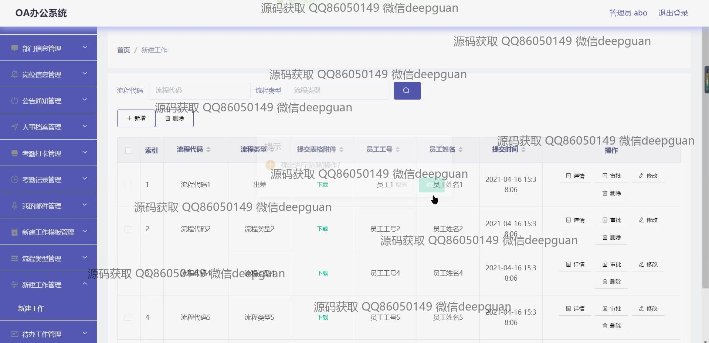

<h1 align="center">基于HTML的OA办公系统+vue</h1>

## 简介
OA办公系统：角色包括管理员、员工；功能涵盖员工管理、部门信息、岗位信息、公告通知、人事档案、考勤打卡、邮件管理、新建工作流程。    --计算机毕业设计源码；毕设源码；java毕业设计源码

## 联系方式

<h3 align="center">获取完整代码与数据库文件 + 微信：deepguan QQ: 86050149 QQ群: 783742310</h3>

<h3 align="center">可帮忙远程部署 包运行成功！提供远程部署、修改代码、设计文档指导、代码讲解等服务！</h3>

## 功能介绍（完整见运行截图）
管理员： 基本功能包括登录、注册员工、退出系统。在系统界面中，管理员可以管理和审核员工信息，设置和管理公告通知，以及管理部门、职位等组织信息。管理员还负责考勤管理、查看和审核打卡信息，以及管理工作流程模板，支持流程代码、流程类型的自定义和审核操作。此外，管理员有权限查看系统中的所有功能模块，如邮件管理、任务分配和日程安排，提高公司内部的运营效率和信息透明度。

员工： 员工可以通过系统进行个人信息的查看与修改，包括基本资料如工号、姓名、部门和联系方式等。员工还能够查看公告通知、管理个人考勤打卡记录，并可查看历史记录和审核状态。系统提供邮件管理功能，员工可通过平台发送和接收公司内部邮件，方便与同事的沟通。此外，员工通过访问新建工作模块，能够提交工作流程，上传相关文档，为日常工作提供便捷的操作平台，提高个人办公效率。

## 运行截图

本代码来源于网络,仅供学习参考使用!

